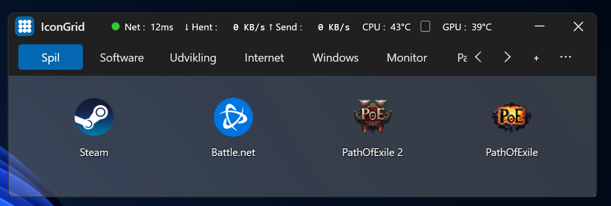
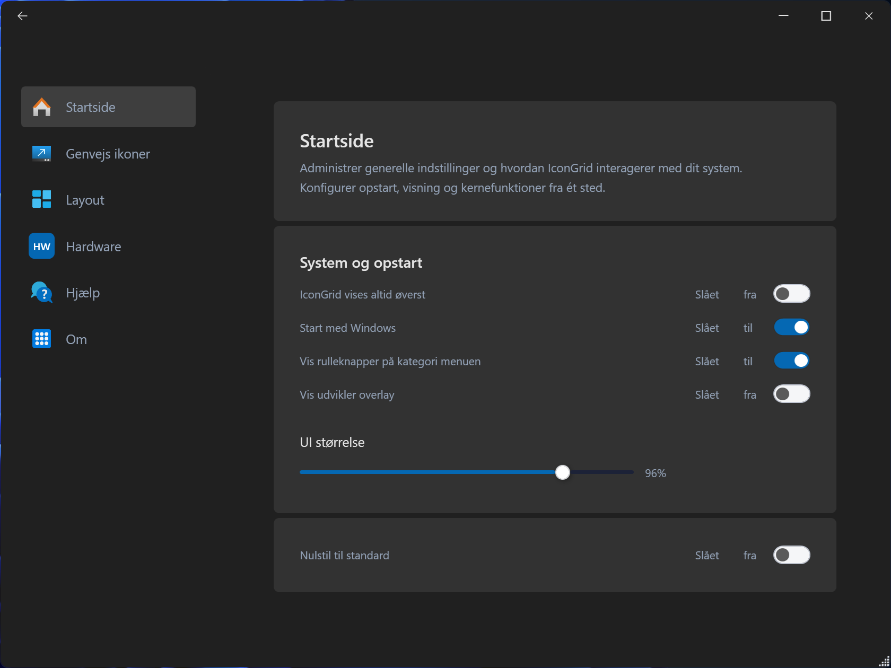

# IconGrid

IconGrid is a highly customizable, lightweight Windows desktop launcher and system hardware monitoring dashboard built with C#, WPF, and the MVVM pattern. It provides streamlined shortcut organization, desktop window layout management, and real-time telemetry embedded directly into its sleek, modern UI.

## Core Application Flow & UI Behavior

IconGrid utilizes a seamless toggle behavior between a discrete desktop overlay and the main launcher dashboard to keep the workspace clean yet immediately accessible.

### 1. Startup & The Floating Icon

* **Aesthetic & Behavior:** Upon startup, IconGrid initializes in a minimized state, displaying only a compact, lightweight **Floating Icon**.
* **Workspace Integration:** This acts as a persistent quick-access overlay that stays on screen (Topmost by default) without obstructing other applications.
* **Left-Click Action:** Clicking the Floating Icon hides it and expands the full application dashboard instantly.
* **Right-Click Action (Full Exit):** Right-clicking the Floating Icon opens a context menu with the option **"Luk programmet helt"** (Close program completely). This is the primary method to terminate the application process entirely.

### 2. Main Launcher Dashboard
* **Interface:** Clicking the Floating Icon expands the interface into the full **IconGrid Dashboard**. This view features organized category tabs, interactive shortcut grids, configuration options, and real-time system metrics.
* **Smart Closing & Minimizing:** Clicking the **"X"** (Close) button in the top-right corner **does not terminate the application**.
* **State Preservation:** Instead, it gracefully hides the main dashboard window and restores the **Floating Icon** back to its previous position on the screen, returning the application to its lightweight background state.

---

## Navigation & Windows Architecture

IconGrid’s user interface is split into two primary consumer-facing window types, transitioning fluidly via the main navigation bar.

### 1. Main Launcher Interface
* **The Dashboard Grid:** Shows the primary tabs (e.g., Games, Software, Development) and hosts the scrollable grid of application shortcuts.
* **Logo-Driven Layout Access:** The `IconGrid` logo in the top-left corner also acts as a layout trigger. Left-clicking the logo applies the currently selected layout preset (defaulting to `Auto`), while right-clicking opens the layout menu for choosing, saving, renaming, and managing window layout presets.
* **The "Indstillinger" Menu:** Located in the top-right corner of the dashboard title bar, there is a **"..." (Indstillinger)** button. Clicking this button acts as the gateway to the advanced management suite.

### 2. Settings & Control Dashboard (SettingsWindow)
* **Behavior:** Clicking the `Indstillinger` button instantly initializes and displays the **Settings Dashboard**.

which acts as the centralized control panel for application configuration.
* **Modular Page Navigation:** This window uses a sidebar navigation menu to load modular sub-pages dynamically into the view layer:
  * `StartsidePage.xaml`: Core system options (e.g., Run on startup, Topmost toggle, UI scaling slider).
  * `GenvejsIkonerPage.xaml`: Management and adjustment of software shortcuts and configurations.
  * `LayoutPage.xaml`: Icon grid templates and custom window layout options.
  * `HardwarePage.xaml`: Comprehensive real-time system monitoring logs and details.
  * `HjaelpPage.xaml`: User documentation, troubleshooting steps, and macro definitions.
  * `AboutPage.xaml`: Software versioning, updates, and compliance notes.
* **Shared Layout Workflow:** The launcher logo menu and `LayoutPage.xaml` are connected to the same underlying layout system, so layout selection and saved presets can be managed both directly from the launcher and from the `SettingsWindow`.

## Key Features

* **Drag-and-Drop Shortcuts:** Easily arrange, add, or group application and game shortcuts into an interactive grid layout.
* **Hardware Monitor Strip:** Embedded directly within the UI, displaying real-time ping (`Net`), network download/upload speeds, and live CPU/GPU temperatures.
* **Window & Layout Presets:** Save custom window arrangements and restore desktop layouts with custom layout presets.
* **Adaptive Theme Engine:** Dynamically synchronizes with the native Windows theme, system accent colors, and taskbar colors. Supports both Light and Dark mode variations.
* **Developer Overlay (DevInspector):** An integrated visual metadata inspector allowing developers to hover over UI components to see their live data-binding context and layout dimensions.

---

## Hardware Monitoring & Telemetry

IconGrid utilizes the [LibreHardwareMonitorLib](https://github.com/LibreHardwareMonitor/LibreHardwareMonitor) framework to gather accurate, low-level system sensor telemetry.

* **Dynamic Sensor Aggregation:** The underlying `HardwareSnapshotCollector` dynamically polls system components for `SensorType.Temperature`, automatically capturing and displaying the highest core values to ensure reliable thermal tracking.
* **Privilege Requirements:** To communicate with hardware registers via the driver abstraction (PawnIO/LibreHardwareMonitor), **Administrator Privileges** are required at startup.

---

## Architecture & Project Structure

The project strictly follows the **MVVM (Model-View-ViewModel)** architectural pattern to maintain a clean separation of concerns between layout rendering and business logic.

### Core Entry & State
* `App.xaml.cs`: The application bootstrapper handles initialization, theme registration, and global resource management.
* `ViewModels/MainViewModel.cs`: The centralized UI state manager containing observable properties, configuration settings, persistence logic, and framework commands (`ICommand`).

### Custom UI Controls (`/Controls`)
Reusable, standardized custom controls designed to keep XAML views lean and maintainable:
* `LauncherLogo.xaml / .cs`: Renders the app logo (a distinct 3x3 dot grid) responding dynamically to the active Windows accent color.
* `SliderRow.xaml / .cs`: A composite control matching a descriptive label, an interactive slider, and a text value box for fluid settings configuration.
* `FloatingIconButton.xaml / .cs`: Encapsulates the minimized floating launcher button, including its visual template, click behavior hooks, and exit context menu.
* `LauncherMonitorRow.xaml / .cs`: Encapsulates the live system monitor strip with ping, network throughput, and CPU/GPU telemetry bindings.
* `LauncherWindowButtons.xaml / .cs`: Encapsulates the top-right minimize/close launcher buttons and forwards their click events to the host window.
* `LauncherTopBar.xaml / .cs`: Encapsulates the main launcher top row as a composition shell for the logo, monitor strip, and window-button controls.
* `LauncherTabsBar.xaml / .cs`: Encapsulates the category tab row, including tab selection, rename/remove menus, scrolling controls, add-category button, and the `Indstillinger` button entry point; category add/rename/remove actions now execute inside the control instead of `MainWindow`.
* `LauncherGrid.xaml / .cs`: Encapsulates the main shortcut area, including the launcher item grid, drag/drop handling hooks, scroll container, empty-state prompt, and shortcut context menus; the shortcut context-menu labels are now resolved directly inside the control.

### UI Behavior Helpers (`/Helpers`)
Focused UI controllers and infrastructure used by the main shell:
* `FloatingIconController.cs`: Owns floating-icon window behavior such as minimized mode, drag movement, screen clamping, and persisted floating position.
* `ConfigManager.cs`: Loads, saves, and migrates persisted application configuration and legacy user data folders.
* `ThemeHelper.cs`: Tracks Windows light/dark mode and accent color changes and broadcasts theme updates to the UI.
* `SystemMonitor.cs`: Aggregates live network and hardware telemetry for the dashboard monitor strip and coordinates snapshot refreshes.
* `DynamicIconHelper.cs`: Builds accent-aware runtime icons so the app and tray icon follow the active Windows theme color.
* `ShortcutHelper.cs`: Converts dropped files, folders, and Windows shortcuts into launcher items that IconGrid can persist and open.
* `DevInspector.cs`: Provides attached metadata hooks for the built-in developer overlay used while inspecting UI bindings and layout.

### Window & Page Layouts (`/Views`)
* **Shell Components:**
  * `MainWindow.xaml / .cs`: The primary shell window coordinating transitions between the floating launcher state and the expanded dashboard while delegating floating-icon, topbar, category-tabs, and launcher-grid UI to dedicated modules; obsolete tab add/rename/remove handlers have been removed as that logic moved into `LauncherTabsBar`.
  * `SettingsWindow.xaml`: A dedicated panel managing global configurations and app preferences.
* **Modular Dashboard Pages:**
  * `StartsidePage.xaml`: Configures system startup settings, user interface scaling, and overlay topmost thresholds.
  * `HardwarePage.xaml`: Displays granular system hardware diagnostics including CPU, GPU, and RAM loads.
  * `GenvejsIkonerPage.xaml`: Manages shortcut population, scaling, and custom grid rows/columns.
  * `LayoutPage.xaml`: Provisions icon layouts, window tracking configurations, and grid presets.
  * `HjaelpPage.xaml`: Built-in user documentation, tooltips, and keyboard macro shortcuts.
  * `AboutPage.xaml`: Version tracking, developer credits, and software licensing.
* **Templates & Diagnostics:**
  * `TemplatePage.xaml` & `TemplateGuidelines.xaml`: Standardized layout guides enforcing design language consistency.
  * `PawnIoWarningWindow.xaml`: User-facing alert handler detailing elevated administrator privilege requirements for hardware monitoring.

---

## Developer Technical Notes

* **Development Environment:** The codebase is optimized for compilation and execution within modern Windows environments and utilizes PowerShell scripting for automated tasks.
* **Local Architecture:** Designed specifically with performance efficiency in mind, ensuring minimal CPU cycles are consumed while keeping background telemetry updates asynchronous.
