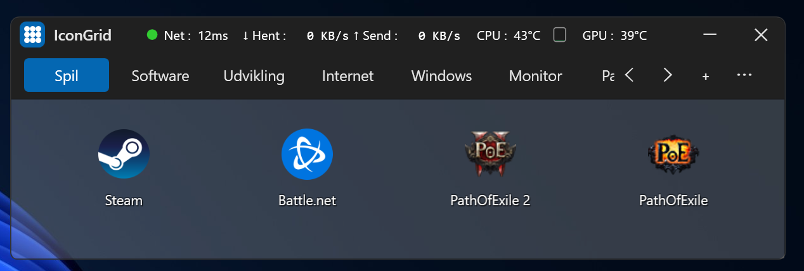
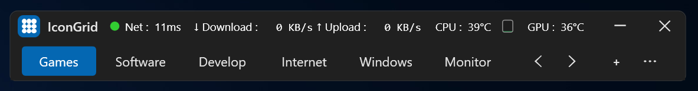
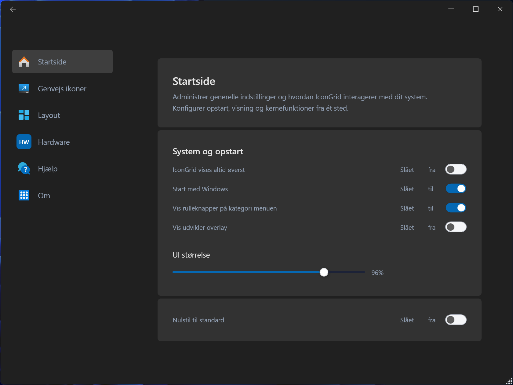

# IconGrid

IconGrid is a Windows launcher and desktop overlay built with WPF and MVVM. It combines shortcut organization, layout presets, settings pages, and live hardware telemetry in a launcher that can collapse into a floating desktop button.

## User flow

### Floating icon


- IconGrid can start in floating-icon mode, or go directly into the full launcher if the new "start directly in launcher" option is enabled on the Startside page.
- Left-click expands the main launcher window.
- Right-click opens the localized exit menu for fully closing the app.

### Main launcher

- `Views/Launcher/MainWindow.xaml` is the main launcher shell.
- The launcher contains the logo area, live monitor strip, tab bar, shortcut grid, and the `Indstillinger` entry point.
- Shortcut icons can be shown in two view modes, controlled by a toggle on the `GenvejsIkoner` (shortcut icons) settings page:
  1. **Carousel view** — the shortcuts are laid out on a single long horizontal row. The window shows exactly 4 icons at a time (same spacing as the grid), and you scroll through the rest with the mouse wheel or the thin horizontal scrollbar.
  2. **Grid view** — the shortcuts are laid out on multiple vertical rows with 4 icons per row, scrolled with the thin vertical scrollbar.
- Closing the launcher hides it back to floating-icon mode instead of terminating the process.



## IconGrid collapsed state Toggle UI View

IconGrid features a clean and simple way to toggle between full and collapsed views. If a category is selected (for example, Games), clicking it once will hide the icon area, collapsing the UI to only show the top bar and system monitors. Clicking the category again will smoothly slide the icon area back down into full view.



### Settings window



- `Views/Settings/SettingsWindow.xaml` is the dedicated settings shell.
- The window hosts sidebar navigation and loads modular pages from `Views/Settings/Pages/`.
- `Views/Settings/SettingsWindowCoordinator.cs` now handles launcher-side opening, reuse, placement, and shutdown of the settings window so `MainWindow` no longer owns that lifecycle directly.

### Gaming overlay monitor

- `Views/Launcher/GamingOverlayWindow.xaml` is the compact always-on-top gaming overlay monitor.
- The overlay reuses the live telemetry stack for network, CPU, GPU, and FPS status presentation in a dedicated single-row shell.
- The gaming overlay is intentionally more game-focused than the main launcher monitor row: `Download` / `Upload` bandwidth stats have been removed from the overlay and remain available only on the main launcher monitor row.
- `Views/GamingOverlayWindowCoordinator.cs` owns opening, reuse, placement, and shutdown of the overlay window.
- The overlay now remembers its last on-screen position and restores it on the next open or after app restart.
- The overlay settings button opens a dedicated inline settings row with a mini overlay-scale slider and a direct link into the full Gaming Overlay settings page.

#### Transparent background

The gaming overlay has two independent transparency modes, configured on the Gaming Overlay settings page:

- **Transparent background** — the overlay background is always transparent. Text color can be customized with the built-in color picker (white, black, yellow, blue, green, pink, cyan, or a custom Windows color).
- **Auto transparent background (while in game)** — the overlay automatically becomes transparent only when a game is running and tracked by IconGrid's FPS pipeline. On the Windows desktop, the overlay keeps its normal opaque background. This gives you the best of both worlds: a clean transparent overlay in-game, and full readability on the desktop.

When either transparency mode is active, the overlay text color switches to the user-chosen custom color — keeping the hardware monitor labels (CPU, GPU, FPS, ping, network) legible against the now-transparent background.

#### Color picker for overlay text

When transparency is enabled, the overlay text color picker becomes visible on the Gaming Overlay settings page. Choose from 7 preset swatches (White, Black, Yellow, Blue, Green, Pink, Cyan) or open the Windows color dialog via "Custom color..." for any RGB value. The selected swatch is highlighted with an accent-colored ring, and custom colors are normalized to hex format for reliable persistence.

#### Recommended game display mode

- Use **Fullscreen Windowed** (borderless) in your games for the best overlay experience. The game fills the screen but Windows keeps the desktop at the monitor's native resolution, so IconGrid can display the overlay correctly on top of the game.
- **Exclusive fullscreen** can change the display mode itself, which may briefly blank the screen or hide/mis-scale the overlay. If the overlay does not appear, switch the game to Fullscreen Windowed.

#### Overlay scale

The overlay scale slider ranges from **100% to 150%** and is the **real physical scale**: 100% is the design size (720x44), 150% is 1.5x larger. The same percentage produces the same on-screen size on every resolution — there is no resolution compensation.

| Screen resolution | Slider 100% | Slider 150% |
|---|---|---|
| 3840x2160 (4K) | 100% | 150% |
| 2560x1440 (1440p) | 100% | 150% |
| 1920x1080 (1080p) | 100% | 150% |

IconGrid can remember a different default scale **per resolution** (set via the Gaming Overlay settings page or by moving the overlay scale slider while a game is running): when a game switches the display to its configured resolution, the overlay automatically adopts that resolution's saved scale, and when the game exits and the original resolution is restored, it scales back to that resolution's saved value. Your Windows display scale (DPI) still affects the physical on-screen size, but the launcher and the overlay scale together, so their proportions stay in sync.

#### Default position

Like classic overlay tools (e.g. FPS Overlay), the gaming overlay can snap to a **user-chosen standard placement**. Pick one on the Gaming Overlay settings page — **Top/Bottom × Left/Center/Right**, or **Custom**:

- **TopLeft / TopCenter / TopRight** — edge/corner along the top of the work area
- **BottomLeft / BottomCenter / BottomRight** — edge/corner along the bottom of the work area
- **Custom** — keep whatever position you drag the overlay to

Whenever the overlay opens or the display resolution changes (game start/exit), it snaps back to the chosen placement so it never ends up mid-screen or off-screen after a mode switch. The overlay is never locked — you can still drag it anywhere afterwards, and that position is preserved (returning to `Custom` keeps it).

### Game Resolution — per-game display resolution switching

IconGrid can automatically switch your monitor to a lower resolution before launching a game, and restore the original resolution when the game exits.

**Why this exists:** When you run Windows at 4K (3840×2160), your desktop is sharp and spacious — but your graphics card may struggle to maintain smooth performance at that resolution in games. The standard solution is to switch the game itself to a lower resolution like 2560×1440 or 1920×1080 — but this only works if the game runs in **Exclusive Fullscreen** mode. In that mode the gaming overlay does appear, but clicking on it alt-tabs you out of the game and back to Windows — making it impractical to interact with.

By running games in **Fullscreen Windowed** mode (required for the overlay) and letting IconGrid switch the whole monitor resolution before launch, you get:
- **Sharp 4K desktop** when working in Windows
- **Smooth game performance** at your GPU's optimal resolution (e.g. 1440p or 1080p)
- **Gaming overlay works** because the game stays in Fullscreen Windowed mode at the new resolution

**How it works:**
- Each shortcut in the launcher can optionally have a **Game Resolution** configured (set on the Game Resolution settings page — pick from common resolutions like 3840×2160, 2560×1440, 1920×1080, etc.).
- When you launch that shortcut, IconGrid changes the primary monitor to the configured resolution before the game starts.
- While the game runs, the resolution is **sticky** — it only reverts when the game process actually exits (not when you alt-tab away or click another window). This is the same target-retention technique used by the FPS pipeline.
- The overlay's scale and position automatically follow the new resolution (see Overlay Scale and Default Position above) — so the overlay looks correct at 1440p without any manual adjustment.
- When the game exits, the original resolution is restored, along with any desktop window layout that was moved during the resolution switch.

**Per-resolution overlay scale** works hand-in-hand with Game Resolution: set your 4K overlay scale to 100%, your 1440p scale to 135% or 150%, and the overlay automatically sizes correctly at every resolution.

## Settings pages

- `StartsidePage.xaml`: startup, topmost behavior, UI scale, general launcher options, and the built-in `Dansk` / `English` language switcher.
- `GenvejsIkonerPage.xaml`: launcher shortcut and icon settings, including the carousel/grid view toggle and scrollbar on/off.
- `LayoutPage.xaml`: layout preset and saved-layout configuration.
- `HardwarePage.xaml`: hardware diagnostics and related status.
- `HjaelpPage.xaml`: help and troubleshooting content.
- `AboutPage.xaml`: version and project information.
- `GamingOverlayPage.xaml`: dedicated gaming overlay settings — overlay scale, per-resolution default scales, default position, transparent background, auto-transparent while in game, and overlay text color picker.
- `GameResolutionPage.xaml`: per-game display resolution configuration — assign a target resolution to each launcher shortcut so IconGrid switches the monitor resolution before the game launches.

## Architecture

### Models

- `Models/` contains the shared data contracts and enums used across the app, including launcher config, layout data, and startup mode definitions.

### ViewModels

- `ViewModels/MainViewModel.cs` remains the root launcher view model.
- `ViewModels/Launcher/` contains launcher-specific state and managers such as tabs, items, layout, theme, overlay, localization, and item launch handling.
- `ViewModels/Settings/` contains config and persistence helpers used to translate and save launcher settings state.
- `ViewModels/Settings/` also contains the smaller state objects that keep `MainViewModel` from turning into a feature dump.

### Views

- `Views/Launcher/` contains the launcher shell.
- `Views/Launcher/GamingOverlayWindow.xaml` contains the dedicated gaming overlay monitor shell and inline settings row.
- `Views/Settings/` contains the settings shell, its pages, dialogs, and coordination helpers.
- `Views/StartsideStyles.xaml` and `Views/TemplateGuidelines.xaml` are shared view resources.

### Controls

- `Controls/Launcher/` contains launcher UI modules such as `LauncherTopBar`, `LauncherTabsBar`, and `LauncherGrid`.
- `Controls/Floating/` contains `FloatingIconButton`.
- `Controls/Common/` contains shared controls such as `LauncherLogo` and `SliderRow`.

### Helpers

- `Helpers/Launcher/` contains launcher-facing infrastructure such as `FloatingIconController`, `SystemMonitor`, `DynamicIconHelper`, and shortcut/icon helpers.
- `Helpers/Settings/` contains config, localization, startup, PawnIO, and theme helpers used by the settings/configuration flow.
- `Helpers/Hardware/` contains hardware-monitor integration types.
- `Helpers/Hardware/` now also contains the ETW/FPS pipeline, native FPS agent launch flow, shared-memory live FPS handoff, probe helpers, and FPS smoothing/fallback logic.
- `Helpers/Converters/` contains shared WPF value converters.
- `Helpers/Common/` contains shared infrastructure such as `RelayCommand` and `DevInspector`.

## Key features

- Drag-and-drop shortcut management in the launcher grid, available in both grid and carousel view.
- Carousel view mode for shortcuts: a single horizontal row of icons (4 visible at a time) that scrolls with the mouse wheel or a thin theme-aware horizontal scrollbar; grid view shows 4 icons per row across multiple vertical rows.
- Live CPU, GPU, ping, and network telemetry in the launcher top bar.
- A dedicated gaming overlay monitor with saved window position, inline quick settings, dedicated overlay settings page, dividers for readability, and live FPS via ETW.
- Layout presets and saved desktop layout restoration.
- Theme synchronization with Windows accent and dark/light mode.
- Built-in developer overlay via `DevInspector`.

## Security & Privilege Separation

To ensure both maximum security and compatibility with Windows User Interface Privilege Isolation (UIPI), IconGrid utilizes a multi-process architecture:

1. **Elevated Worker Process (Admin):** Runs with administrator privileges exclusively to interface with `LibreHardwareMonitorLib` and fetch low-level hardware telemetry (CPU/GPU temperatures, clocks).
2. **Standard Non-Elevated UI Process:** The main launcher grid, floating desktop icon, and shortcut management run as a standard user. 

### Benefits of this Architecture:
- **Flawless Drag-and-Drop:** Because the UI runs without admin rights, users can freely drag and drop shortcuts from Windows Explorer into the launcher grid without being blocked by UIPI.
- **No Admin Contamination:** Any game, browser, or application launched from within IconGrid correctly inherits standard user privileges, preventing untrusted applications from gaining elevated system access.

## Hardware monitoring

IconGrid uses `LibreHardwareMonitorLib` for telemetry collection. Hardware access may require administrator privileges at startup because PawnIO and hardware driver access are part of the monitoring flow.

## FPS capture and ETW access

- IconGrid now captures FPS through a passive ETW-based pipeline.
- The current implementation uses a separate native FPS worker:
  - `Native/FpsAgent/src/main.cpp`
  - launched via `Helpers/Hardware/NativeFpsAgentRunner.cs`
- The ETW path is passive only:
  - no injection
  - no DLL detours
  - no graphics API hooking
- Relevant Windows graphics providers are:
  - `Microsoft-Windows-DxgKrnl`
  - `Microsoft-Windows-DXGI`
  - `Microsoft-Windows-D3D9`

### Important Windows requirement

- On systems where ETW graphics access is restricted, the current Windows user may need to be added to:
  - `Performance Log Users`
  - Danish Windows name: `Brugere af ydelseslog`
- After adding the user, a sign-out/in or reboot may be required before FPS capture starts working.
- The Gaming overlay settings page now includes an FPS setup status section to help confirm whether this requirement is already satisfied.

### Current FPS pipeline

- game renders frames
- native FPS worker captures present events through ETW
- native FPS worker publishes live FPS through:
  - a shared-memory live channel for the hottest path
  - `native-fps-state.json` as fallback / diagnostics
- elevated hardware agent reads native FPS state
- `FpsMeter` still maintains:
  - a direct `live` FPS path
  - a smoothed `trend` FPS path for fallback / diagnostics
- launcher / gaming overlay prefers the shared-memory live FPS path
- `fps-state.json` remains as a compatibility / fallback handoff for broader monitor state
- overlay shows a single live FPS number tuned for faster response

### Currently tested games (2026-08-04)

FPS capture has been validated with these titles:

| Game | FPS source | Status | Notes |
|------|-----------|--------|-------|
| **Path of Exile 1** | PrimaryApi (DXGI) | ✅ Perfect | Guld-standard: holder target stabilt ved alle vindues-skift |
| **Path of Exile 2** | PrimaryApi (DXGI) | ✅ Works | Reel FPS svinger når unfocused — ETW viser korrekt render-rate |
| **Call of Duty (cod22-cod.exe)** | PrimaryApi (DXGI) | ✅ Works | Intro >200 FPS, menu ~100 FPS. Bag unrelated presenteret vs displayed FPS adfærd når unfocused |
| **Tom Clancy's The Division 2** | PrimaryApi (DXGI) | ✅ Works | Render stopper helt ved de-fokus (Nvidia bekræfter 0 FPS). Sidste kendte FPS vises via sticky-hold |
| **Stumble Guys** | PrimaryApi (DXGI) | ✅ Works | Testet 2026-08-04 |
| **RHYTHM SPROUT Demo** | PrimaryApi (DXGI) | ✅ Works | Testet 2026-08-04 |
| **Yuzu (emulator)** | DxgKrnlFallback | ⚠️ Overcount | Emulator-normalisering klampet til ~60 FPS. Hurtig target-acquisition |
| **Fireworks Mania** | PrimaryApi (DXGI) | ✅ Works | Direkte .exe launch, hurtig lock |

FPS pipeline-status per 2026-08-04:
- **Sticky-target retention:** Grace period (3000ms) i native agent forhindrer target-tab ved foreground-skift
- **Hold sidste FPS:** Når spil stopper rendering i baggrunden, vises sidste kendte FPS i stedet for `--`
- **Spike filter bypass:** Når confirmed target holder, bruges raw ETW FPS uden spike-filter indblanding

### Current limitation

- ETW capture is now working, but the remaining work is still the last bit of display responsiveness for very small FPS changes.
- Shared memory removed a meaningful chunk of handoff latency, but an in-game counter can still feel slightly closer to the render loop.
- Near-term improvement work is expected to focus on:
  - validating the new shared-memory live path across more games
  - catching tiny FPS dips/spikes even earlier
  - optional frametime display
  - deciding whether the remaining live FPS fallback path should be simplified further

## Developer notes

- The project targets Windows and is organized around small WPF shells plus modular controls/state helpers.
- After the current refactor, launcher UI, settings UI, helpers, and feature-specific view-model code are grouped by responsibility rather than staying flat in a few root folders.
- See `ARCHITECTURE_RULES.md` for the guardrails we use to keep `MainWindow` and `MainViewModel` from growing into feature dumps again.
- Local workflow/planning notes such as Git workflow reminders are intentionally kept under `.local-state/` and are not part of the GitHub-facing repo documentation.

### MCP notes server (runs from this GitHub repo)

- The `icongrid-notes` MCP server lives **in this repository** at `tools/mcp-notes-server/` and is the single source of truth — it is versioned with git like normal code and therefore backed up on GitHub. There is no separate/older local copy.
- It provides note tools (`list_notes`, `read_note`, `search_notes`, `append_to_note`, `replace_in_note`, `update_note` legacy alias) plus `check_architecture_rules` and `check_version_consistency` for the IconGrid workspace.
- Fresh-clone setup: in `tools/mcp-notes-server/` run `npm install` once, then register the server in Cline's MCP config (`cline_mcp_settings.json`) with:
  ```json
  {
    "command": "node",
    "args": ["E:/IconGrid-GitHub/tools/mcp-notes-server/src/index.js"],
    "env": { "ICONGRID_WORKSPACE": "E:\\IconGrid-GitHub" },
    "disabled": false
  }
  ```
  (Replace the `args`/`env` paths if the repo lives at a different location.)
- Because the server runs from the repo, any change to `tools/mcp-notes-server/` is shipped to GitHub together with the regular code commit — keeping the MCP tooling in sync with the repo automatically.
- See `AGENT.md` ("Session memory") for full usage details.

## Local data folder

IconGrid stores user data in `%APPDATA%\IconGrid`, which on a standard Windows profile resolves to `C:\Users\<user>\AppData\Roaming\IconGrid`.

Current files and folders in that directory:

- `config.json`: launcher settings, layout settings, window positions, language, theme, startup toggle, and saved layout data.
- `items.json`: launcher shortcuts grouped by category/tab. This is installation-specific and may not be portable to a new PC if shortcut paths change.
- `monitor-state.json`: temporary live state used by the hardware-monitor row to show current CPU/GPU readings.
- `fps-state.json`: compatibility/fallback live state used by the launcher and gaming overlay when the direct live path is unavailable.
- `native-fps-state.json`: raw native FPS worker state used by the elevated monitor path and diagnostics.
- `trace.log`: app trace output for startup and runtime diagnostics.
- `error.log`: fatal error log written after unhandled startup/runtime failures.
- `IconPack\`: optional cached icon pack assets used by the launcher. This folder can be empty if no pack has been migrated or installed yet.

The data folder is created automatically on startup by `ConfigManager`.
`config.json` is the main file for restoring a user's IconGrid setup after reinstall or migration. `items.json` can be useful on the same machine, but should be treated as machine-specific rather than guaranteed portable.

## Hardware monitor startup

IconGrid uses a split startup model:

- Windows startup launches the launcher UI silently through Task Scheduler.
- The launcher UI starts with `--startup-launch` when Windows logs in.
- The hardware monitor runs as a separate scheduled task named `IconGrid Monitor` with `--monitor-agent`.
- The monitor task is elevated so CPU/GPU telemetry can still work.
- The FPS worker is separate from the desktop-facing UI and is launched through the monitor-side flow when gaming overlay FPS is needed.
- Manual launcher starts still keep the normal UAC behavior for the monitor path.
- If "start directly in launcher" is enabled, the launcher opens straight into the full UI and skips the floating icon on Windows sign-in, logon, and restart.
- The startup-mode selector was removed from `StartsidePage.xaml` after the Task Scheduler vs. legacy test phase.
- If Windows startup ever launches a duplicate or elevated IconGrid instance again, the first thing to check is Task Scheduler for stale `IconGrid` or `IconGrid Monitor` tasks.

This keeps the UI non-elevated while preserving hardware telemetry access and avoiding the extra `Conhost` / `schtasks` startup chain.

## Versioning

IconGrid uses Semantic Versioning with beta builds during active refactor and feature work. See `VERSIONING.md` for the release flow.

Current version: `0.7.0-beta.1`
